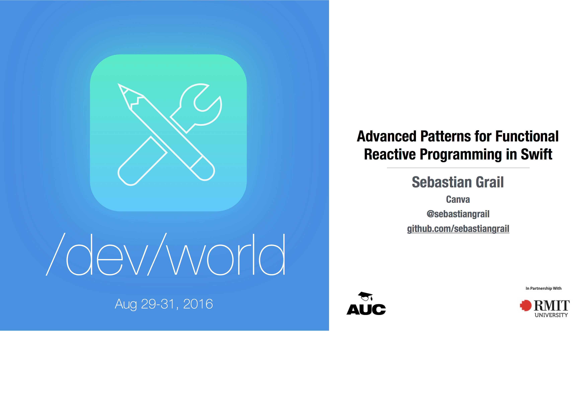

footer:  Sebastian Grail — /dev/world/2016 —  @sebastiangrail
slidenumbers: true



<!-- # Advanced Patterns for Functional Reactive Programming in Swift

- Sebastian Grail
-  iOS Developer at Canva
-  @sebastiangrail
- github: sebastiangrail
 -->

^ - Slides and sample code on github
  - Questions at the end or via github issues
  - Who is using FRP in production?
  - Which library? RAC, RxSwift?

---

# What we'll cover

- Chaining asynchronous tasks with `flatMap`
- Managing state with `scan`
- Handling errors
- Unfolding

^ Examples use ReactiveCocoa 4, but prinicples apply to all FRP frameworks

---

## Chaining Network Requests

```swift
func doSomeNetworkStuff (arg: Foo, callback: (Bar) -> Void)

doSomeNetworkStuff(foo) { bar in
	doSomeOtherStuff(bar) { baz in
		whenDoesThisEverEnd(baz) { foobar in
			ohGodPleaseStop(foobar) { asdf in
				actuallyUseStuff(asdf)
			}
		}
	}
}
```

^ Better than before objc blocks, but still pretty terrible

---

## Chaining Network Requests

```swift
func doSomeNetworkStuff (arg: Foo) -> SignalProducer<Bar, NoError>

doSomeNetworkStuff(foo)
	.flatMap(doSomeOtherStuff)
	.flatMap(thisIsntTooBad)
	.flatMap(iCouldGoOn)
	.startWithNext { result
		actuallyDoStuff(result)
	}
```

^ Steps are listed linearly, scales well
  => What if we're interfacing existing callback code?
  
---

```swift
func createProducer <T, U>
                    (f: (T, U -> Void) -> Void)
				  


}
```

^ We start with a function that takes a callback based async function

---

```swift
func createProducer <T, U>
                    (f: (T, U -> Void) -> Void)
				    -> T -> SignalProducer<U, NoError> {


}
```

^ And return a new, signal based function
  From here the implementation follows the types

---

```swift
func createProducer <T, U>
                    (f: (T, U -> Void) -> Void)
				    -> T -> SignalProducer<U, NoError> {
    return { t in
        
		
		
		
		
		
    }
}
```

^ Return a function taking a `T`

---

```swift
func createProducer <T, U>
                    (f: (T, U -> Void) -> Void)
				    -> T -> SignalProducer<U, NoError> {
    return { t in
        return SignalProducer { observer, _ in


        }
    }
}
```

^ That function returns a `SignalProducer`
  The `SignalProducer` is initialised with a startHandler which is called when the producer is started
  startHandler takes two arguments, first is the observer that we can send events to

---

```swift
func createProducer <T, U>
                    (f: (T, U -> Void) -> Void)
				    -> T -> SignalProducer<U, NoError> {
    return { t in
        return SignalProducer { observer, _ in
            f(t) { u in


            }
        }
    }
}
```

^ When the producer is started, we want to start the original request so we call `f(t)` and supply the callback

---

```swift
func createProducer <T, U>
                    (f: (T, U -> Void) -> Void)
				    -> T -> SignalProducer<U, NoError> {
    return { t in
        return SignalProducer { observer, _ in
            f(t) { u in
                observer.sendNext(u)
                observer.sendCompleted()
            }
        }
    }
}
```

^ The last step left is sending the value to the observer and completing the signal
  There is a similar function for callbacks that can fail
  => Network requests arent' the only tasks we can model as Signals

---

## Observing events from a button before it is created

---


^ If we can model the alert controller as a signal, we can chain it using flatMap

---

```swift
    SignalProducer<(), NoError> { (observer, _) in
        let alert = UIAlertController(... preferredStyle: .ActionSheet)
		
        rootVC.presentViewController(alert, animated: true, completion: nil)
    }
```

^ Start with creating a `SignalProducer`
  when started, presents an AlertController
  `rootVC` should probably be `weak`, omitted for brevity
  
---

```swift
SignalProducer<(), NoError> { (observer, _) in
    let alert = UIAlertController(... preferredStyle: .ActionSheet)

	alert.addAction(UIAlertAction(title: "Sign out", style: .Destructive) { _ in


    })
  
    rootVC.presentViewController(alert, animated: true, completion: nil)
}
```

^ Add an action for "Sign out"
  
---

```swift
SignalProducer<(), NoError> { (observer, _) in
	let alert = UIAlertController(... preferredStyle: .ActionSheet)

	alert.addAction(UIAlertAction(title: "Sign out", style: .Destructive) { _ in
		observer.sendNext()
		observer.sendCompleted()
	})
  
	rootVC.presentViewController(alert, animated: true, completion: nil)
}
```

^ When the button is tapped, sendNext and complete

---

```swift
SignalProducer<(), NoError> { (observer, _) in
    let alert = UIAlertController(... preferredStyle: .ActionSheet)
    
	alert.addAction(UIAlertAction(title: "Sign out", style: .Destructive) { _ in
        observer.sendNext()
        observer.sendCompleted()
    })
	
    alert.addAction(UIAlertAction(title: "Cancel", style: .Cancel) { _ in
        observer.sendCompleted()
    })
	
    rootVC.presentViewController(alert, animated: true, completion: nil)
}
```

^ For cancel, all we need to do is sendCompleted, in this case the signal doesn't send any values


---

```swift
let logoutSignal = cogButton.flatMap(.Latest) { _ in
    return SignalProducer<(), NoError> { (observer, _) in
        let alert = UIAlertController(... preferredStyle: .ActionSheet)
        
		alert.addAction(UIAlertAction(title: "Sign out", style: .Destructive) { _ in
            observer.sendNext()
            observer.sendCompleted()
        })
		
        alert.addAction(UIAlertAction(title: "Cancel", style: .Cancel) { _ in
            observer.sendCompleted()
        })
		
        rootVC.presentViewController(alert, animated: true, completion: nil)
    }
}
```

^ Now we can use the producer in a `flatMap` on an existing button
  touches on `cogButton` now present the alert and send the appropriate events

---

## Filtering and  mapping with `flatMap`

```swift
let someSignal: SignalProducer<Int, Error> = ...

someSignal.flatMap { n in
	if n % 2 == 0 {
		return SignalProducer(value: n*n)
	} else {
		return SignalProducer.empty
	}
}
```

^ `flatMap` can map by returning a value wrapped in a producer
   remove values from the stream by return an empty producer
   with this we can implement complex control flow graphs

---

- On button tap
- Start network request
- If payemnt required
  - Present UI with confirm/cancel
    - On confirm start new request
	- On cancel end the whole chain

---

```swift
button
	.flatMap(exportDocument)
	.flatMapError { error in
		guard error == .PaymentRequired else {
			return SignalProducer(error: error)
		}
		return showPaymentUI()
			.flatMap(processPayment)
			.then(exportDocument)
	}
```

---

## Understanding flatten strategies

- `.Merge`: All values from all producers are forwarded immediately
- `.Concat`: Values are sent in the order of the producers
- `.Latest`: Only values from the latest producer are forwarded

<!-- ---

```swift
SignalProducer { observer, _ in
	...
	observer.sendNext(signal1)
	...
	observer.sendNext(signal2)
	...
	observer.sendCompleted
}.flatten(strategy)
``` -->

---

## `.Merge`

```
|-1-----2-----------3---|
           |a--b------------c-|

|-1-----2---a--b----3-------c-|
```

^ - Starts producers when they are sent
  - Immediately forwards all values from all producers
  - Sends all values from all producers
  - Completes when all inner and outer producers complete

---

## `.Concat`

```
|-1-----2-----------3---|
           |a--b-------------c-|

|-1-----2-----------3----a--b-------------c-|
```

^ - Starts producers sequentially
  - Sends all values from all signals
  - Completes when all inner and outer producers complete

---

## `.Latest`

```
|-1-----2-----------3---|
           |a--b-------------c-|

|-1-----2---a--b-------------c-|
```

^ - Starts producers when they are sent
  - Only sends values from the latest producer are forwarded
  - Values may be dropped
  - Completes when the outer producer the latest producer sent complete

---

## Counting button taps

- button with target/action
- counter variable
- method for the button target that mutates the couter

^ code in 3 different places, hard to isolate state

---

## Counting button taps

```swift
var counter = 0
let counterSignal = plusButton.map { _ -> Int in
    counter += 1
    return counter
}
```

^ wrong implementation

---

## Counting button taps

```swift
var counter = 0
let counterSignal = plusButton.map { _ -> Int in
    counter += 1
    return counter
}
```

- Observation changes the signal
- Different observers get different streams of values

---

## Summing an array of `Int`s

```swift
[1,2,3]
```

---

## Summing an array of `Int`s

```swift
[1,2,3].reduce(0, +) // => 6
// (((0 + 1) + 2 ) + 3)
```

---

## Summing an array of `Int`s
## with intermediate values

```swift
[1,2,3].scan(0, +) // => [0,1,3,6]
// (((0 + 1) + 2 ) + 3)
```

^ scan is not in the Swift stdlib but can be found in many FP languages

---

## Keeping state between events with `scan`	

```swift
// Array
func reduce <U>
	        (initial: U, combine: (U, Value) -> U)
			-> U
```

---

## Keeping state between events with `scan`	

```swift
// Array
func scan   <U>
            (initial: U, combine: (U, Value) -> U)
		    -> [U]
```

---

## Keeping state between events with `scan`	

```swift
// Array
func scan <U>
           (initial: U, combine: (U, Value) -> U)
		   -> [U]

// SignalProducer
func scan <U> 
		  (initial: U, combine: (U, Value) -> U)
		   -> SignalProducer<U, Error>
```

---

## Keeping state between events with `scan`

```swift
plusButton
    .scan(0) { runningTotal, _ in runningTotal + 1 }
    .startWithNext { (x) in
        print("total number of taps: \(x)")
    }
```
	
---

## Keeping state between events with `scan`	


```swift
plusButton.map { 1 }
    .scan(0, +)
    .startWithNext { (x) in
        print("total number of taps: \(x)")
    }
```

---

## Keeping state between events with `scan`

```swift
SignalProducer.merge([plusButton.map  {  1 },
                      minusButton.map { -1 }])
    .scan(0, +)
    .startWithNext { (x) in
        print(x)
    }
```

---

## Switch between live and snapshot rendering

```swift
renderingMode.producer.scan((nil, .Live)) { old, newMode in
    switch (old.mode, newMode) {
        case (.Live, .Snapshot):
			return (self.contentView.snapshotViewAfterScreenUpdates(false), .Snapshot)
        default:
			return (old.snapShotView, newMode)
    }
}.startWithNext(
    switch $0 {
    case (.Some(let oldView), .Live):
        oldView.removeFromSuperview()
    case (.Some(let newView), .Snapshot) where newView.superview == nil:
        self.contentView.addSubview(newView)
    }
})
```

^ `state` is a tuple of `UIView?` and `RenderingMode`
  `RenderingMode` is either `.Live` or `.Snapshot`
  edited for brevity

---

## Handling Errors

- Once an error occurs, a signal (and all its derived signals) stop sending values
- `signal.flatMap(.Latest, f)` fails when the producer returned by `f` fails
- Completes when both `signal` and the latest result of `f` complete

---

## Handling Errors

```swift
login: (String, String) -> SignalProducer<User, LoginError>

name.combineLatestWith(password)
	.sampleOn(button)
	.flatMap(.Latest) { x,y in
	    login(x,password: y)
	}
```

---

## Handling Errors with `flatMapError`

```swift
func flatMapError <F> 
	              (handler: Error -> SignalProducer<Value, F>)
				  -> SignalProducer<Value, F>
```

- Starts a new producer when an error occurs
- Changes the type of the error
- Keeps the type of the value

---

## Handling Errors with `materialize`

```swift
func materialize()
	 -> SignalProducer<Event<Value, Error>, NoError>
```

- Moves all events into the value
- Errors on the original signal complete the resulting signal

---

## Handling Errors with `materialize`

```swift
name.combineLatestWith(password)
	.sampleOn(button)
	.flatMap(.Latest) { x,y in
	    login(x,password: y)
	}
```

^ Example where chain fails when login fails

---

## Handling Errors with `materialize`

```swift
name.combineLatestWith(password)
	.sampleOn(button)
	.flatMap(.Latest) { x,y in
	    login(x,password: y).materialize()
	}
```

^ When login fails, chain is still able to send values
  Login errors are now sent as valus and can be handled

---

## Handling Errors with `materialize`

```swift
name.combineLatestWith(password)
	.sampleOn(button)
	.flatMap(.Latest) { x,y in
	    login(x,password: y).materialize()
	}


SignalProducer<User, LoginError>
SignalProducer<Event<User, LoginError>, NoError>

```

---

## Handling Errors with `retry`

```swift
signalThatCanFail
	.retry(n)
```

- Swallows up to `n` errors
- Fails after `n`th error
- Errors need to be handled before `retry`  

<!--
---


## Synchronising signals

- Run an animation while waiting for a network request
- Start animation and request together
- but only handle results when animation is finished

^ .Concat flatten strategy does almost but not quite what we want

---

## Synchronising signals

```swift
func waitFor <OtherValue>
	(other: SignalProducer<OtherValue, Error>)
	-> SignalProducer<Either<Value, OtherValue>, Error>
{
	...
}
```

---

## Synchronising signals

```swift
func waitFor <OtherValue>
	(other: SignalProducer<OtherValue, Error>)
	-> SignalProducer<Either<Value, OtherValue>, Error>
{
	return SignalProducer<Either<Value, OtherValue>, Error> {
	}
}
```

---

## Synchronising signals

- Write once use anywhere
- Can combine arbitrary signals
- All the state is encapsulated -->


---

## Unfolding

- `reduce` is also known as `fold`
- `fold` goes from a series of values to one value
- `unfold` goes from one value to a series of values

---

## Unfolding

```swift
func getDesigns (token: Token)
		        -> SignalProducer<([Design], Token), Error>
```

- each call returns an array of designs and a continuation token
- token from one call loads the next set of designs

---

## Unfolding

```scala
func unfold <T, V, E: ErrorType>
	 (f: T -> SignalProducer<(V, T), E>)
```

---

## Unfolding

```scala
func unfold <T, V, E: ErrorType>
	 (f: T -> SignalProducer<(V, T), E>, initial: T)
```

---

## Unfolding

```scala
func unfold <T, V, E: ErrorType>
	 (f: T -> SignalProducer<(V, T), E>, initial: T)
	 -> SignalProducer<V, E>
```

---

## Unfolding

```scala
func unfold <T, V, E: ErrorType>
	 (f: T -> SignalProducer<(V, T), E>, initial: T)
	 -> SignalProducer<V, E>
{
	return f(initial)
}
```

---

## Unfolding

```scala
func unfold <T, V, E: ErrorType>
	 (f: T -> SignalProducer<(V, T), E>, initial: T)
	 -> SignalProducer<V, E>
{
	return f(initial).flatMap(.Concat) {
	}
}
```

---

## Unfolding

```scala
func unfold <T, V, E: ErrorType>
	 (f: T -> SignalProducer<(V, T), E>, initial: T)
	 -> SignalProducer<V, E>
{
    return f(initial).flatMap(.Concat) {
        return unfold(f, initial: $1).startWith($0)
    }
}
```

---

# Thanks!


